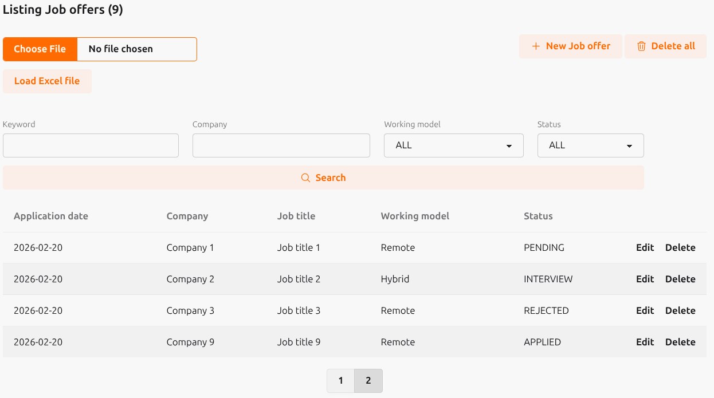

# JobApplications

Aplicación web **MVC** con **Elixir** y **Phoenix** para la gestión de solicitudes de ofertas de trabajo.



## Tecnologías

- Elixir 1.17.3
- Phoenix Framework 1.8.3
- Base de datos: PostgreSQL

## Tabla de base de datos: job_offers

```
    application_date: Fecha 
    company: string 
    job_title: string 
    working_model: string 
    job_description: string 
    sector: string 
    experience: string 
    salary_range: string
    requested_salary: integer 
    status: string 
    response_date: date 
    response: string 
    observation: string
```

## Desarrollo entorno local

- Iniciar postgresql: `docker compose up -d`
- Instalar dependencias: `mix deps.get`
- Iniciar servidor phoenix: `mix phx.server`
- Acceder a: [`localhost:4000`](http://localhost:4000)
- Ejemplo de excel a cargar: `example.xlsx`

## Ejecutar entorno local

- Iniciar postgresql y job-applications: 
```
docker compose -f local-deploy.yml up -d
```
- Acceder a: [`localhost:4000`](http://localhost:4000)
